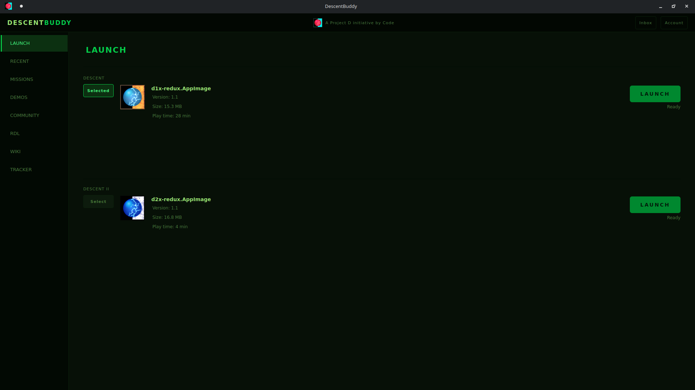
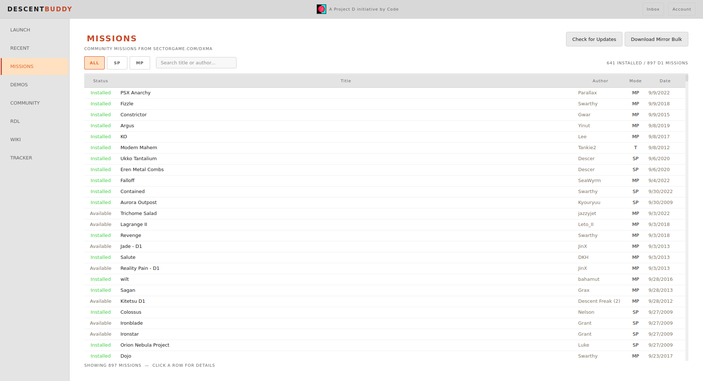
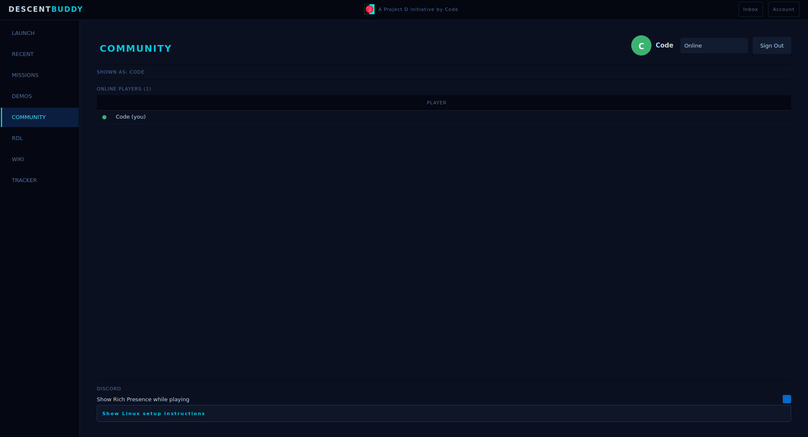

# Descent Buddy b1.0

> This client will wrap around your DXX-Redux (1/2) client and enhance your experience as much as possible!

## Screenshots

---

## Features

- DXMA linked Mission browser
- Click-to-get mission download (UX Experience)
- Custom Descent EXE/AppImage launcher
- Non-game Steam compatibility
- Windows 10-11/Linux cross-use
- Social Community Status (Online, Invite, etc.)
- Built in RDL Website
- Built in Tracker (retro-tracker.cc)
- Built in Descent Nexus Wiki
- Uses accounts + notif. inbox from RDL
- Tracks session and total time played for D1/D2
- Discord Rich Presence Activity statuses
- Edit the DXX .ini with GUI
- Easy view of debug/output logging
- Social Networking Notification sounds
- Easier access to demo files (recover latest 2)
- Start client WITH PC boot
- 6 Customizable themes

---

And the best part is... this is 100% legal to use! This program is designed to be lightweight, and as efficient as possible.
